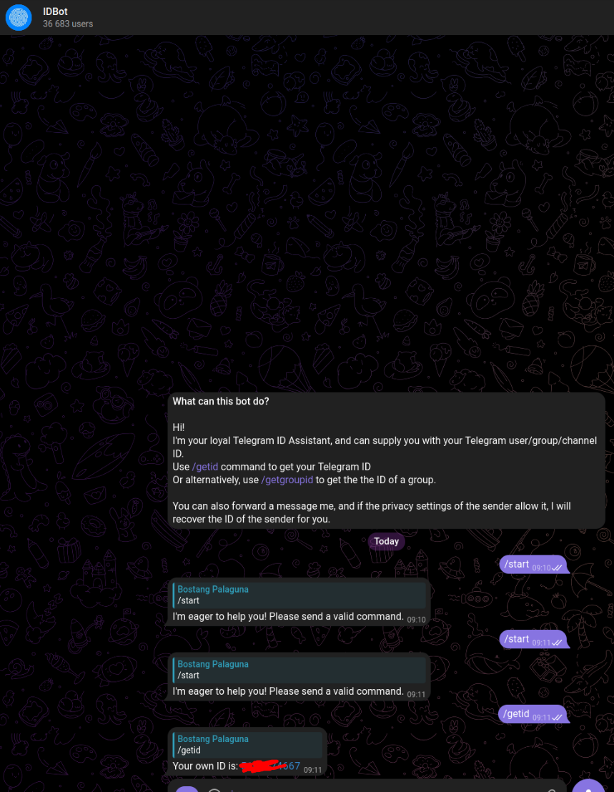
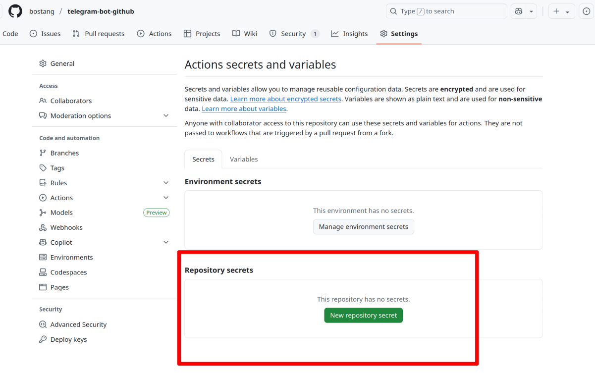
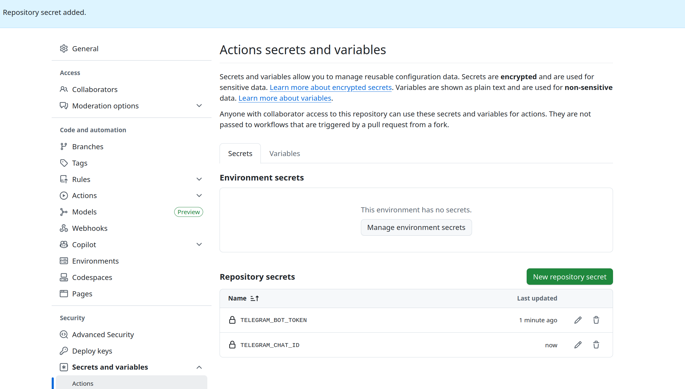

# Telegram Bot Github

Menggunakan Bot Telegram sehingga ketika push ke github maka akan masuk notifikasi lewat bot.

⭐ Berguna untuk alerting system

## Cara mendapatkan Token dan ID

chat `@BotFather`!

[bot-father](./img/bot-father.png)

chat `@myidbot`

## Cara Menjalankan

Pastikan bahwa di github repostiry sudah diatur `secrets` sebagai beirkut:

maka push kode, langsung akan masuk sebuah notifikasi ke telegram

